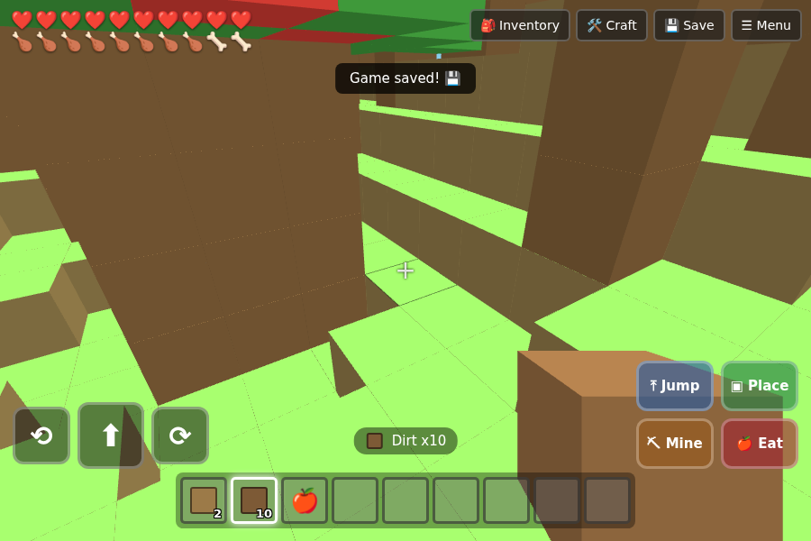
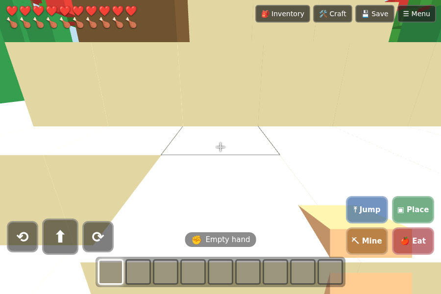

# ⛏️ Blocky World — Creative Mode

A tiny, kid-friendly sandbox game in the browser, inspired by Minecraft's
creative mode. Everything is blocky — the world, the trees, the animals and
you. Explore a forest or a desert, punch trees, dig up ores, craft tools and
build whatever you like. 🌳🏜️

It's a single web page built with plain HTML/CSS/JavaScript and
[Three.js](https://threejs.org/) for the 3D graphics. No build step, no
installing anything.




## ▶️ How to play it

**Easiest:** double-click `index.html` and it opens in your web browser.

**Best (so saving always works):** run a tiny local web server in this folder
and open the address it gives you. Pick whichever you have:

```bash
# Python (almost always installed)
python3 -m http.server 8000
# then open http://localhost:8000 in your browser

# ...or Node.js
npx serve
```

Everything (Three.js included) is bundled in this folder, so it works
completely offline.

**On an iPhone/iPad:** play in **portrait or landscape** — the controls and
hotbar rearrange to fit either way. For a true full-screen game with **no Safari
address bar or bottom toolbar**, open the page in Safari, tap **Share → Add to
Home Screen**, then launch it from the new icon — it runs edge-to-edge with the
on-screen controls kept clear of the notch and home indicator. (A normal Safari
tab can't hide its toolbar; only Home-Screen apps can.)

## 🎮 Controls

On a phone/tablet use the on-screen buttons. On a computer you can use the
buttons **or** the keyboard.

| Action | On-screen | Keyboard |
| --- | --- | --- |
| Walk forward | ⬆ | `W` / `↑` |
| Jump (swim up in water) | 🤸 **Jump** (right next to ⬆) | `Space` |
| Climb a ladder | face it &amp; hold ⬆ (or **Jump**) | `W` / `Space` |
| Look around / turn | drag the screen | `A` `D` / `←` `→` |
| Walk up/down stairs | just walk into them (no jump) | `W` / `↑` |
| Place / Use | **Place** (or tap the world) | `F` |
| Punch / Mine | **Mine** (or tap the world) | `Q` |
| Eat (apple / watermelon) | **Eat** | `E` |
| Pick a hotbar slot | tap a slot | `1`–`9` |

Looking is **inverted by default** — dragging *down* tilts your view *up* (and
up tilts down), like a flight stick. Prefer it the other way? Flip it under
**⚙️ Settings** on the title/menu screen.

A quick **tap** on the world acts at the crosshair; **dragging** looks around.
Tapping a **tree, leaves, cactus or an 🍎 apple always grabs/punches it** — even
with a block in your hand — so you never "place" by accident. **Mined leaves go
into your backpack** so you can build with them. To **build**, tap
the ground or press **Place** (which builds anywhere). The targeted block gets a
coloured outline (gold for food) so you can tell what you're pointing at.

## ✨ What's in the game

- 🌍 An open, fully blocky world you spawn into — **forest** or **desert**.
- 👤 First-person view with a blocky character (you can see the item in your hand).
- 🌳 **Punch trees** to collect wood. Apple trees dangle red apples down low —
  aim the crosshair at one and tap to pick it (even with a block in your hand).
- 🍉 **Watermelons** grow on the ground (light green with dark-green stripes) —
  pick them up, build with them, or eat them.
- 🍎 **Blocky health and food bars.** Two rows of chunky little squares in the
  top corner — red for health, tan for food — in keeping with the pixel look.
  Food drips down *slowly* — eat apples or watermelons so you don't starve. If
  your food runs out you start losing health.
- 🌗 **Day & night.** Every **6 minutes of daylight** is followed by **2
  minutes of night**, when the sky darkens and the world dims — then day
  returns. After dark the monsters come out: a **🏹 skeleton archer** roams the
  surface loosing **arrows in random directions**, and **🧟 three zombies**
  shamble about at random — **bump into one and it bites you** (a heart's worth).
  All of them **vanish again at daybreak**. Craft and **wear** some armour or a
  shield (see below) and the skeleton's arrows just **bounce off**.
- 🛡️ **Armour & shields.** At a crafting table you can make **helmets,
  chestplates, leggings, boots and shields** in three tiers — **wooden** (planks),
  **iron** (iron ingots) and **diamond**. Open your **backpack** and **tap a piece
  to put it on**: it slides into its **equipment slot** at the top (tap the slot
  again to take it off). Each piece has its own little **shaped icon** tinted by
  its material, and an **equipped shield shows in your hand**. While you're
  **wearing armour or holding a shield you can't be hurt by monsters at all** —
  skeleton arrows, zombie bites, ghast fireballs and wither skulls all just
  **bounce off** (lava, falls and hunger can still get you, though!).
- 🪨 **Fall damage:** jumping off something too tall hurts.
- 😴 If your health runs out, a gentle **"You needed a nap!"** screen pops up —
  then you can respawn.
- 🐷 **Animals** — pigs, sheep, donkeys, horses and dogs wander the ground, and
  🐒 **monkeys** swing in the trees. You *can't* hurt any of them. **Tap a
  ground animal to climb on and ride it** — then **steer it with the normal
  controls** (drag to look, ⬆ to walk, 🤸 to jump); tap again to hop off. Build a
  **fence** around a field and the animals stay penned inside it.
- 🧑‍🌾 **Villagers** live in **tall walled settlements** with soaring,
  torch-topped corner spires — easy to spot poking up above the treetops from
  anywhere in the world. **Tap one to trade** — they take 💚 **emeralds** (smelt
  emerald ore in a furnace) and sell you paints and other goodies to decorate
  your house.
- 🟨 **A four-settlement adventure on a yellow brick road.** A bright **yellow
  brick road** starts near where you spawn and winds out to **four settlements**,
  each grander than the last:
  - The **first villager** trades you a 🗝️ **key** to the **locked house** where
    the **second villager** lives.
  - The second villager hands you the **key to the third house** — also locked.
  - Inside the third house is a 🔥 **portal to the Nether**, a fiery red cavern
    where **👻 ghasts float overhead and spit fireballs** — a hit costs you
    **two hearts**, and each ghast only fires **once per visit** (it goes quiet
    until you leave and come back). Down there a **🐷 piglin** snuffles around
    the floor: **trade it a gold ingot** and it hands back a random **💎 diamond,
    💚 emerald, or 🖤 netherite**. **Netherite** is now **pitch black** and very
    **rare** to mine — the surest supply is the **loot chest in the brick Nether
    fortress**, or the piglin. That fortress is a **two-storey keep**: climb the
    **brick stairs** to the **second floor**, where the chest holds **netherite,
    diamonds, emeralds and good building blocks** (glowstone, obsidian, gold).
    But it's **guarded by 💀 the Wither**
    — a floating, three-headed, legless menace that **flings wither skulls in
    random directions**. If a skull hits you, you get the **wither effect**: the
    screen darkens and you **lose a heart every few seconds for 6 seconds**
    before it wears off.
  - The **third villager** wants **netherite** in exchange for the **last key**,
    which opens the **fourth house** — and inside waits a ✨ **portal to The
    End**, the grand finale.
  - Each villager gives you a key **only once**. You can **mine your way into
    the first three houses** if you'd rather not chase the keys — but the final
    **End-portal house is sealed** (walls, roof and floor), so the ending stays
    locked behind that last key.
- ✨ **The End — the finale.** Step through the fourth house's dark, starry
  portal into **The End**: a pale island floating in an endless void.
  - A 🐉 **Ender Dragon with glowing purple eyes** wheels overhead and **breathes
    purple fire** at you — but you're handed a suit of **armour** on arrival, so
    the fire just **bounces off**.
  - Four **very tall spiral staircases** rise from the island, each crowned with
    a glowing 🔮 **End Crystal**. **Climb them** (just walk up — no jumping) and
    **tap the crystal at the top** to collect it.
  - Gather all **four crystals** and **craft an Exit Portal** (four crystals in a
    square). Place it, **step through**, and the **credits roll** to celebrate
    your win before dropping you back to the **Home Screen**. 🏆
  - There's **no portal back to the overworld** from The End — the crafted Exit
    Portal is the only way out — and the game **never saves while you're in The
    End**, so it's always a fresh dash to the finish.
- 💧 **Ponds and watering holes** of water with **sandy shores** dot the
  surface — every world gets a few (even the desert gets an **oasis** or two) —
  plus **clay** (grey, brown and red) to dig up near the water and underground,
  which you can smelt into **bricks** — each laid out with a proper
  **running-bond brick pattern**.
- ☁️ **Clouds** drift high across the sky in puffy white patches. They're just
  fluffy sky, so **you can't mine them** — try and the game gently says so.
- 🎋 **Sugar cane** grows along the water's edge. Punch it to collect it, then
  **craft 3 sugar cane into 3 📄 paper** at a crafting table — and **craft paper
  over wood into a 📖 book**.
- 🪣 **Water Bucket.** Tap water with a bucket to scoop it up; the **Water
  Bucket** then shows **how many waters** it's holding and can keep collecting
  **as much as you like**. Tap the ground to pour one back out — or **pour it
  onto 🔥 lava to make ⬛ obsidian** (**pitch black, flecked with purple**).
  Frame a doorway in obsidian and **light it with flint & steel**: each portal
  you make opens onto a **fresh portal at a random spot in the Nether**, and if
  you **mine away the frame** the purple light — and its Nether twin — **wink
  out**.
- 🔥 **Lava** turns up all over: **pools scattered underground** at every depth
  (dig down to find them) and the odd **glowing lava lake right on the surface**.
  Lava is far too hot to pick up, but **pour water on it and it cools into
  obsidian**.
- ⛏️ **Ores to mine:** coal, iron, gold, redstone, diamond and emerald — each
  a stone block **speckled with little square flecks** of its own colour (in the
  world and on its inventory icon), keeping with the blocky look, so you can spot
  it underground.
  Stone and ores need a **pickaxe** (wooden or stone); dig down and mine the
  cyan-flecked blocks for diamond.
- 🔥 **Furnaces.** Craft one from **4 stone** (it has a distinctive glowing
  firebox so it's easy to spot), place it and tap it. Load a **fuel** (coal, or
  a long-lasting **battery**) and something to **smelt**: sand → **glass**, clay
  → a single **🧱 brick**, **iron ore → iron ingot**, **iron ingot → 🔩 steel**,
  emerald ore → **emerald**, **gold ore → gold ingot**, **redstone ore →
  redstone**, and **diamond ore → 💎 diamond**. The smelting recipes are listed
  **right in the furnace** — tap one to load it. **Craft four bricks in a square
  → a Bricks block** you can build with (brown clay and red clay make brown and
  red bricks the same way).
- ⬛ **Make obsidian from lava and water.** Dig down to an underground **lava
  pool**, then **pour a bucket of water onto the lava** and it cools into
  **obsidian** right where they meet. Mine the obsidian with a pickaxe to build
  with it.
- 🌀 **Build your own Nether portal.** Stand obsidian up into a **frame** (a
  ring of obsidian around a pocket of air), then **light the inside with 🔥
  flint & steel** — the air flares into a purple portal. Walk in to reach the
  Nether. To make flint & steel: **chip flint from a piece of coal**, **smelt an
  iron ingot into steel**, then **craft the two together**.
- 🚪 **Doors & windows** you can **tap to open and close**, **🛏️ beds**, **🔦
  torches**, and a **📦 chest** that stores lots of extra items.
- 🎒 An **inventory** + hotbar with distinctive material icons and a title that
  names whatever you tap. Whatever you select goes into your hand — hold a block
  and place it; hold a pickaxe and mine.
- 🛠️ **Crafting — a real shaped grid, like Minecraft.** The **Craft** button
  opens a **2×2** grid; a **Crafting Table** opens the full **3×3** grid. Tap an
  item, then tap squares to lay out a recipe (or tap an entry in the recipe book
  to auto-arrange it), then tap the result square to make it:
  - **Planks** (×4) = 1 wood · **Stick** = 2 wood stacked
  - **Crafting Table** = 4 wood in a square · **Furnace** = 4 stone in a square
  - **Bricks** block = 4 🧱 bricks in a square (smelt clay for the bricks)
  - **Torch** (×4) = coal on top of a stick
  - **Wooden / Stone Pickaxe**, **Ladder**, **Stairs**, **Fence**, **Battery**,
    **Bed**, **Chest**, **Window**, **Door** and a **Door with a window**
    *(3×3 table)*
  - **Stairs** (×4) = 6 planks in a staircase shape — **just walk into them to
    go up or down a level, no jumping needed**
  - **Paper** (×3) = 3 sugar cane · **Book** = paper over wood
  - **Flint** = 1 coal · **Flint & Steel** = flint + steel (lights a portal)
  - **Paint wood** any colour = wood + a paint (bought from a villager)
  - Place ladders up a wall, then **face one and hold forward (or jump)** to
    climb; let go to slide back down. Ladders never cause fall damage.
- 💾 **Save your progress** to the browser's local storage with the Save button
  (it also autosaves every 30 seconds). Press **Continue** on the title screen
  to come back to your world later.
- ⏰ **Take-a-break reminder.** After **17 minutes** of play the game **saves
  and pauses itself** and shows a friendly **Break Time!** screen — with a
  **"do a stretch" logo**, plus a bird, a water bottle and a toilet — and a
  **3-minute countdown bar**. The reminder says *get water, go to the bathroom,
  do a stretch, stick your head outside*. When the bar
  runs out a **Resume** button appears so you can jump back in. The break counts
  down against the real clock and is **saved**, so **reloading the page won't
  skip it** — the break is waiting right where you left it.

## 🗂️ How the code is laid out

```
index.html            the page + all the on-screen buttons/menus
css/style.css         the look of the buttons, bars and menus
manifest.webmanifest  full-screen web-app metadata (Add to Home Screen)
icons/                app icons (generated by tools/make-icons.mjs)
js/data.js            constants, block/item definitions, recipes, random helpers
js/world.js           world generation, block storage, rendering, animals, aiming
js/player.js          movement, collisions, the camera, fall damage, hunger
js/game.js            ties it together: inventory, crafting, controls, saving, loop
vendor/three.min.js   the Three.js 3D library (bundled so it runs offline)
test/smoke.mjs        an automated headless browser test
test/verify-features.mjs  headless tests for the newer gameplay features
test/verify-quest.mjs     headless tests for the four-settlement Nether quest
tools/make-icons.mjs  regenerates the app icons from media/icon.svg
```

The world is split into square **chunks** and drawn with one Three.js
`InstancedMesh` per block type *per chunk*; only blocks with an exposed face are
sent to the GPU. Editing a block re-meshes just its chunk (and a neighbour if
the block sits on the chunk's edge) instead of rebuilding the whole world.
Aiming uses a fast voxel raycast (the classic Amanatides & Woo grid traversal).

## 🧪 Running the test (for developers)

There's an automated smoke test that launches the game in a real (headless)
browser and checks that worlds generate, you can move, craft, place, mine,
eat, and save/load. It uses [Playwright](https://playwright.dev/):

```bash
# needs Playwright + a chromium browser installed
PW_ROOT="$(npm root -g)" node test/smoke.mjs
# and the feature tests (inverted look, water bucket, stairs, riding, …)
PW_ROOT="$(npm root -g)" node test/verify-features.mjs
# and the quest tests (road, keys, locked doors, Nether, ghasts, credits)
PW_ROOT="$(npm root -g)" node test/verify-quest.mjs
```

The smoke test prints a checklist and writes `test/screenshot.png` (forest) and
`test/screenshot-desert.png` (desert).

---

Made as a fun hobby project. Have fun building! 🧱
